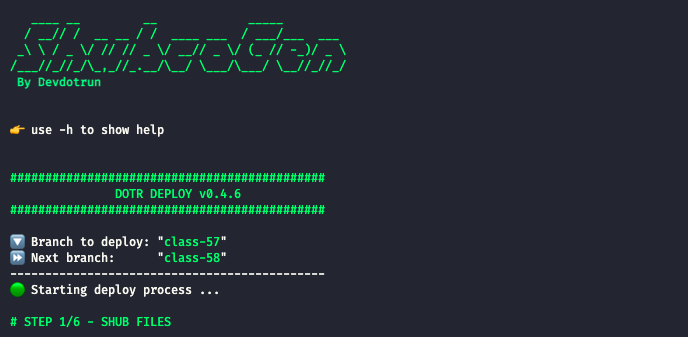

# <p align="center">ShubCoGen Template™ 💀</p>

<!-- TODO: Add image --->

## 💬 About

**S**keleton Git**Hub** **Co**urse **Gen**erator.

This is a `template` with some scripts to `automate` `deploy` and the `initial setup` of a new **Co**urse that will be hosted on **Git**Hub.




## 📜 Requirements
- [Git](https://git-scm.com/)
- [Curl](https://curl.haxx.se/)
- [Bash](https://www.gnu.org/software/bash/)
- [iconv](https://ss64.com/bash/iconv.html)

## 🕹 Usage

### ☝️ First things first (once)

```sh
./init.sh
```
<!-- TODO: Add example image --->

Use `./init.sh` to initialize your project.
This script will fill the `README.md` file with your project's information. And will create the `.shub-config` file.

`.shub-config` example:
```json
{
    "version": "v0.0.4",
    "username": "John Doe",
    "github_username": "john-doe",
    "project_name": "clean arch api",
    "project_repo_name": "clean-arch-api",
    "project_repo_link": "https://github.com/john-doe/clean-arch-api.git",
    "course_source": "Uncle Bob",
    "course_name": "Clean Architecture",
    "course_link": "http://cleancodecourse.com/",
    "course_type": "class",
    "course_multiple": "false",
    "vcs": "false"
}
```

#### ❓ What will happen?

After running this script, you'll be prompted to enter your project's information and some configs. Don't worry, you can always change this later at `shub-config.json`.

> ⚠️ Important: You'll be prompt to enter a couse type (class, episode, etc), and after that to initialize a new branch base on the course type. If you choose so, you'll be able to use the deploy script, and automate tag creation, commit to notes.md files and deploy on GitHub (see the section below).

> 💡 You only need to do this **once**.  
> 💡 You can edit the `.shub-config` file to change the project's information.  
> 💡 You can user the `.shub-config` file in other projects to share your project's information.

### 🚀 Let's deploy


```sh
./deploy.sh
```

<!-- TODO: Add example image --->

Use `./deploy.sh` to deploy your project on GitHub.
> 💡 This script is optional.

#### ❓ What will happen?

This script auto-increments the version number of the branch and creates a new tag from branch name.

So you must be in a branch with a number at the end, like `class-1` or `class-1.1`.

For example, if your actual branch is `class-1`, after running this script, the steps below will be performed:

1. Shub files will be commit automatically & notes.md` will be update with the new "project version number" like `## CLASS-2`
2. Checkout to `main` branch
3. branch `class-1` will be automatically merged into `main`
4. A new tag `class-1-some-description` will be created
5. The `main` branch will be sent to GitHub with the new tag (with `git push --follow-tags`)
6. A new branch `class-2` will be created


#### 🤷‍♂️ Optional arguments

```sh
./deploy.sh [-a] [-m message] [-h]
  -a: Accept all
  -m: Tag message
  -h: Help
```

`-a` Accept all suggestions, and deploy project.  
`-m` Set tag message.  
`-h` Show help.  

## 🆕 Features
- [x] `Readme.md` template
- [x] `notes.md` template
- [x] Deploy script (`deploy.sh`)
- [x] Deploy script arguments (`[-a] [-m message] [-h]`)
- [x] Self-update (based on latest release)
- [x] Auto tagging
- [x] State file (to save deploy state)

## 📌 Roadmap
- [ ] Improve `README.md`
- [ ] Add video tutorial to `deploy.sh` && `init.sh`
- [ ] Add technologies selection in `init.sh`
- [ ] Add requirements selection in `init.sh`
- [ ] Add badges generation
- [ ] Save deploy state (if an error occurs)
- [ ] Add tests (with [Bat](https://github.com/bats-core/bats-core))
- [ ] Add a Dev mode
- [ ] Fix `confirm` exit behaviour
- [ ] Add offline mode

## 🔗 Useful links
- https://gitignore.io
- https://github.com/github/gitignore
- https://shields.io/
- https://simpleicons.org/
- https://github.com/simple-icons/simple-icons/blob/develop/slugs.md
