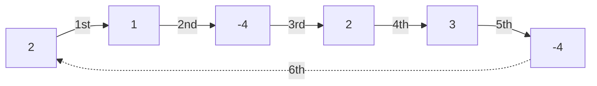

# Single Cycle Check

| Source | https://www.algoexpert.io/questions/single-cycle-check |
|---|---|
| Difficulty | Medium |
| Category | Graphs |

You're given an array of integers where each integer represents a jump of its 
value in the array. For instance, the integer `2` represents a jump of two indices 
forward in the array; the integer `-3` represents a jump of `three indices backward 
in the array.

If a jump spills past the array's bounds, it wraps over to the other side. For
instance, a jump of `-1` at index `0` brings us to the last index in the array.
Similarly, a jump of `1` at the last index in the array brings us to index `0`.

Write a function that returns a boolean representing whether the jumps in the
array form a single cycle. A single cycle occurs if, starting at any index in
the array and following the jumps, every element is visited exactly once before
landing back on the starting index.

**Sample Input**
```ts
array = [2, 3, 1, -4, -4, 2]
```

**Sample Output**
```ts
true
// 2  -> 1 -> -4 -> 2 -> 3 -> -4 -> 2
// 3  -> -4 -> 2 -> 1 -> -4 -> 2 -> 3
// -4 -> 2 -> 3 -> -4 -> 2 -> 1 -> -4
// -4 -> 2 -> 1 -> -4 -> 2 -> 3 -> -4
// 2  -> 3 -> -4 -> 2 -> 1 -> -4 -> 2
```

Graphical Representation:


## Hints

<details>
<summary>Hint 1</summary>
In order to check if the input array has a single cycle, you have to jump through all of the elements in the array. Could you keep a counter, jump through elements in the array, and stop once you've jumped through as many elements as are contained in the array?
</details>

<details>
<summary>Hint 2</summary>
Assume the input array has length n. If you start at index 0 and jump through n elements, what are the simplest conditions that you can check to see if the array doesn't have a single cycle?
</details>

<details>
<summary>Hint 3</summary>
Given Hint #2, there are 2 conditions that need to be met for the input array to have a single cycle. First, the starting element (in this case, the element at index 0) cannot be jumped through more than once, at the very beginning, so long as you haven't jumped through all of the other elements in the array. Second, the (n + 1)th element you jump through, where n is the length of the array, must be the first element you visited: the element at index 0 in this case.
</details>

<details>
<summary>Optimal Space &amp; Time Complexity</summary>
O(n) time | O(1) space - where n is the length of the input array
</details>
