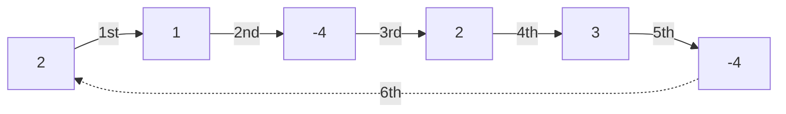

# Single Cycle Check

| Source | https://www.algoexpert.io/questions/single-cycle-check |
|---|---|
| Difficulty | Medium |
| Category | Graphs |

You're given an array of integers where each integer represents a jump of its 
value in the array. For instance, the integer `2` represents a jump of two indices 
forward in the array; the integer `-3` represents a jump of `three indices backward 
in the array.

If a jump spills past the array's bounds, it wraps over to the other side. For
instance, a jump of `-1` at index `0` brings us to the last index in the array.
Similarly, a jump of `1` at the last index in the array brings us to index `0`.

Write a function that returns a boolean representing whether the jumps in the
array form a single cycle. A single cycle occurs if, starting at any index in
the array and following the jumps, every element is visited exactly once before
landing back on the starting index.

**Sample Input**
```ts
array = [2, 3, 1, -4, -4, 2]
```

**Sample Output**
```ts
true
// 2  -> 1 -> -4 -> 2 -> 3 -> -4 -> 2
// 3  -> -4 -> 2 -> 1 -> -4 -> 2 -> 3
// -4 -> 2 -> 3 -> -4 -> 2 -> 1 -> -4
// -4 -> 2 -> 1 -> -4 -> 2 -> 3 -> -4
// 2  -> 3 -> -4 -> 2 -> 1 -> -4 -> 2
```

Graphical Representation:


## Hints

<details>
<summary>Hint 1</summary>
...
</details>

<details>
<summary>Hint 2</summary>
...
</details>

<details>
<summary>Hint 3</summary>
...
</details>

<details>
<summary>Optimal Space &amp; Time Complexity</summary>
O(??) time | O(??) space - where ?? is ...
</details>
